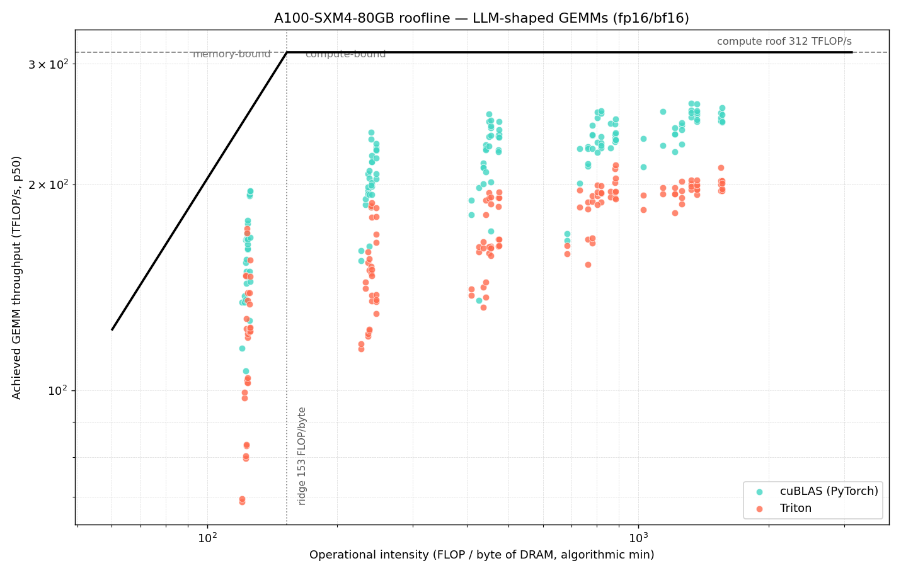
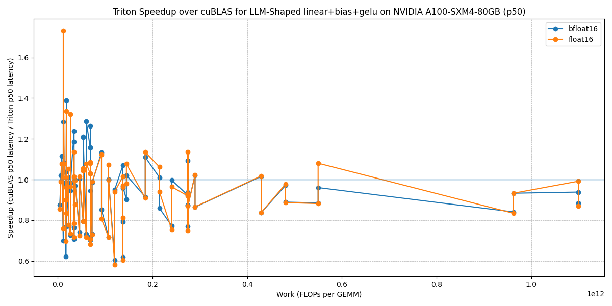
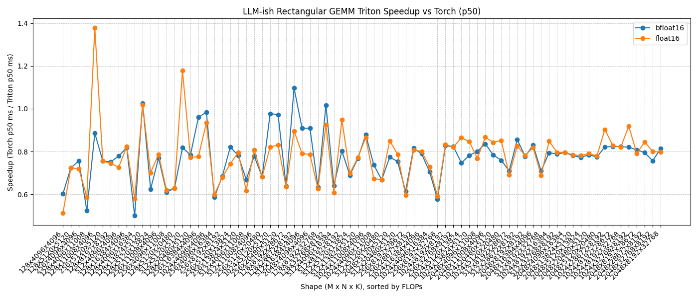

# Triton vs cuBLAS: LLM Kernel Benchmarking Suite

Benchmarks Triton fused GPU kernels against cuBLAS / PyTorch baselines for the matmul shapes that dominate LLM inference (projection and FFN GEMMs), and measures where hand-written fusion actually wins. Run on an NVIDIA A100-SXM4-80GB.

It reports p50 latency, GEMM-equivalent TFLOP/s, effective memory bandwidth, and p90/p50 tail jitter across 76 LLM-shaped GEMM shapes, and isolates the regime where a fused `linear + bias + activation` Triton kernel beats a separate cuBLAS GEMM plus epilogue.

## Key results (A100-SXM4-80GB, fp16)

| Result | Value | Where |
|---|---|---|
| Fused `linear+bias+GeLU` vs cuBLAS, best small-batch FFN shape | **1.73x lower p50 latency** | M=128, N=11008, K=4096 |
| Triton GEMM peak throughput | **213 TFLOP/s (~68% of A100 fp16 tensor-core peak)** | bare autotuned GEMM, rectangular FFN shapes; the fused linear+bias+GELU kernel peaks at 215 TFLOP/s GEMM-equivalent |
| Shapes benchmarked | **76** LLaMA/Mistral-style projection and FFN GEMMs | `src/shapes.py` |
| Metrics per shape | p50/p90 latency, TFLOP/s, GB/s, p90/p50 jitter | `data/*.csv` |

**Where the win is.** cuBLAS is very well tuned for large dense GEMM, so a bare Triton GEMM is generally not faster (median about 0.78x vs PyTorch/cuBLAS across the 76 shapes). The win comes from fusion: folding `linear + bias + GeLU/SiLU` into one Triton kernel removes an intermediate HBM round-trip and a kernel launch. That pays off at small-batch, memory-bound FFN projections, up to 1.73x there, with the fused kernels at about parity (median 0.96x) elsewhere. The suite is built to show where that crossover is.

## Roofline: why the win is where it is



The two headline results are the same story seen twice. Plotting each shape's achieved throughput against its operational intensity (FLOP per byte of DRAM traffic) on the A100's ceilings (312 TFLOP/s compute, 2039 GB/s HBM, ridge at **153 FLOP/byte**) splits the 76 shapes cleanly:

- **Small-batch shapes (M=128) are memory-bound** — operational intensity about 125 FLOP/byte, left of the ridge, reaching only ~39% of compute peak. They are bottlenecked by HBM traffic, so cutting an epilogue round-trip via fusion is a direct latency win. The best fused result (1.73x at M=128, N=11008, K=4096) lands exactly here.
- **Larger-batch shapes (M>=256) are compute-bound** — right of the ridge, reaching ~60% of peak, where cuBLAS's tuned tensor-core scheduling beats a bare Triton GEMM (the ~0.78x median).

The fusion win is not incidental: the roofline predicts the regime it falls in. Built from the committed CSVs with no GPU (operational intensity uses the algorithmic-minimum DRAM traffic, so achieved-vs-roof is the efficiency headroom). Regenerate: `python scripts/roofline.py`.

## Plots





## Methodology

- **Shapes** (`src/shapes.py`): 76 rectangular GEMMs matching LLaMA-7B/13B/70B and Mistral-7B projection/FFN dimensions, swept over batch and sequence sizes.
- **Kernels** (`src/kernels/`): a tiled Triton `matmul`, and a fused `linear_bias` kernel with optional GeLU/SiLU epilogue.
- **Timing** (`src/utils.py`): CUDA-event timing with warmup, multiple trials, and p50/p90/std plus a p90/p50 jitter ratio for tail stability.
- **Throughput / bandwidth** (`src/bytes_model.py`): GEMM-equivalent TFLOP/s and a fused-vs-unfused HBM-traffic model that attributes speedups to eliminated global-memory passes. Bandwidth is a comparative IO model, not hardware counters; use it for relative fused-vs-baseline comparison.
- **Correctness** (`src/correctness.py`): every kernel is checked against the reference with explicit tolerances before timing.
- **GeLU**: fast GeLU, `gelu(x) = x * sigmoid(1.702x)`, used consistently across reference and Triton so correctness checks stay meaningful.

## Reproduce

```bash
pip install -r requirements.txt          # CUDA GPU + driver required (results here: A100-SXM4-80GB)
bash scripts/run_all_a100.sh             # runs all benchmarks -> data/*.csv
python scripts/plot_results.py           # regenerates plots/ from data/
```

Single benchmarks: `bench_gemm_square.py`, `bench_gemm_llm_rect.py`, `bench_linear_bias_epilogue.py --epilogue {gelu,silu,bias}` (under `benchmarks/`).

## Environment

NVIDIA A100-SXM4-80GB, CUDA-capable driver, Python 3.9+, PyTorch 2.1+, Triton 2.1+. Raw measurements are committed under `data/` (filenames stamp the GPU and date). Scripts are portable to other CUDA GPUs, but absolute numbers will differ by architecture and driver.

## Limitations and future work

- Single-GPU, inference-shaped GEMMs; no distributed or training-loop measurement.
- Absolute throughput is hardware and driver specific; the fusion speedup is the portable finding.
- The 1.73x is the best small-batch fused shape, not a blanket claim (see "Where the win is" above).
- Next: fused QKV projection and attention epilogues, KV-cache read/write kernels, and an edge-inference comparison on Jetson Orin (see [edge-llm-gpu-profiling](https://github.com/harshithkantamneni/edge-llm-gpu-profiling)).

## Author

**Harshith Kantamneni**, MS ECE, UW-Madison. GPU performance engineering, Triton/CUDA kernel optimization, systems benchmarking.
